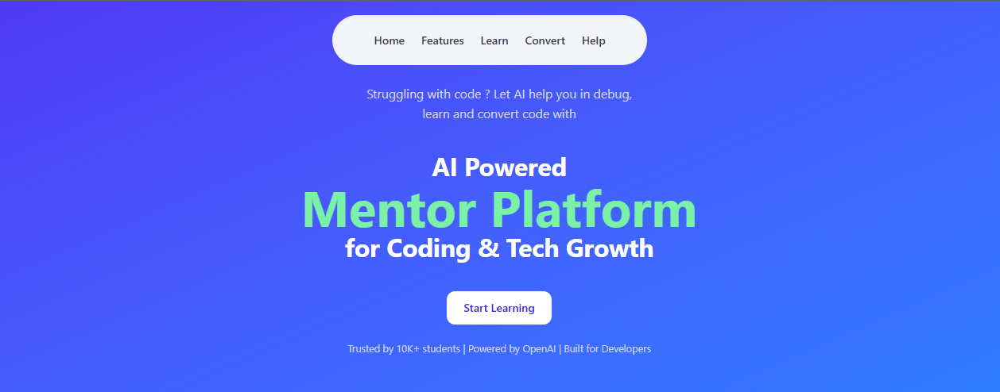
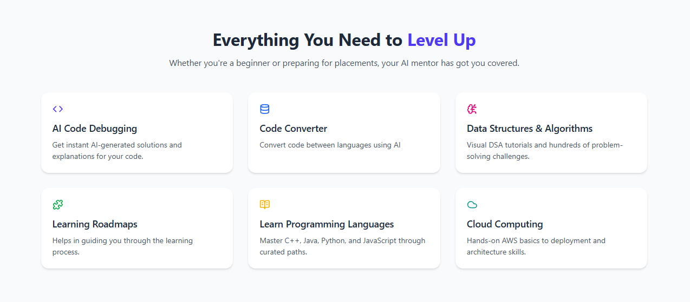
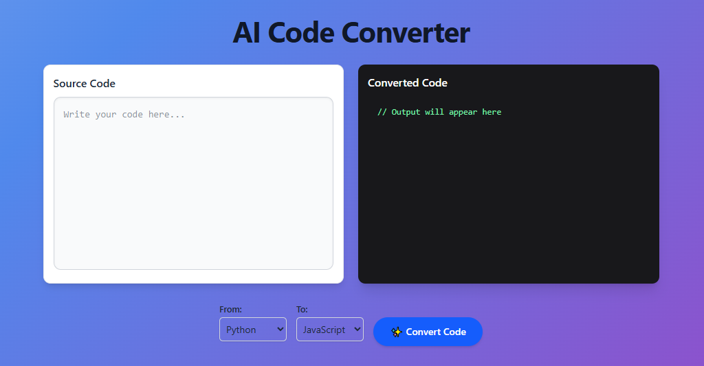
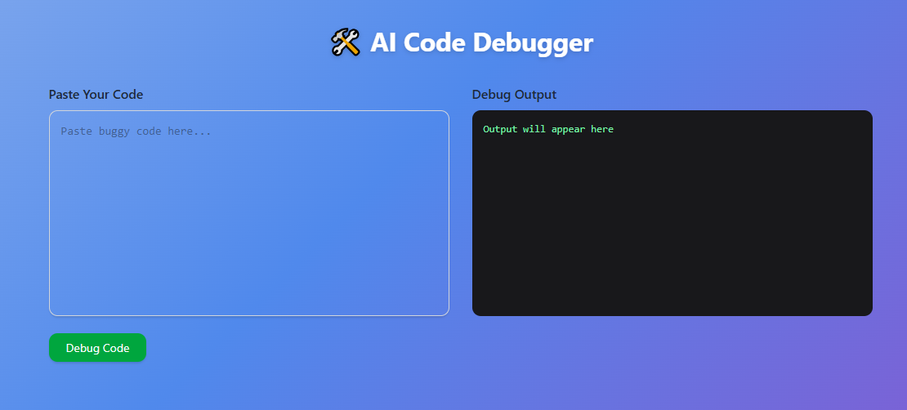
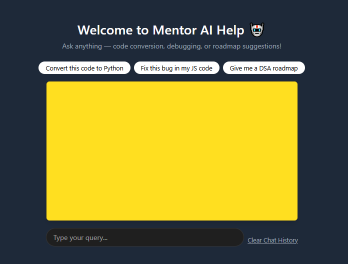
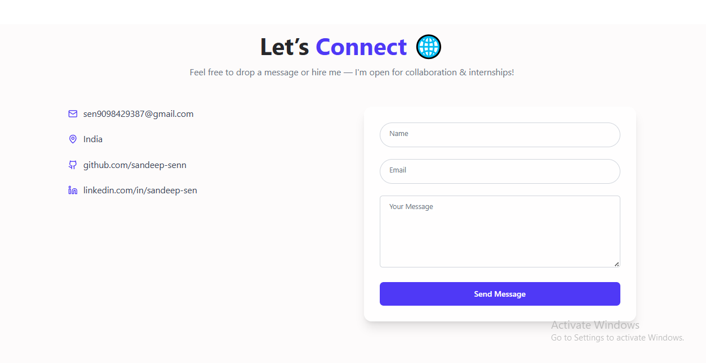
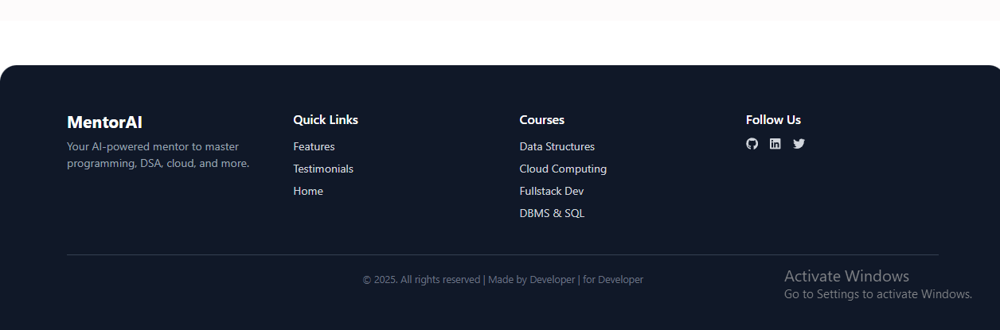

**🚀 Mentor AI - Your Personal AI Learning Companion**

Mentor AI is a full-stack AI-powered web application that helps students learn and grow through interactive tools like:

📚 Smart Roadmaps (DSA, DBMS, ML, CN, etc.)

🤖 AI Chatbot for theory + guidance

🔁 Code Converter (e.g., Python ➡ JavaScript)

🛠️ Code Debugger with instant fixes

📖 Theory, Notes, and Examples for every topic

Mentor AI is designed to be your personal AI mentor 24x7 — whether you're debugging, learning a topic, or need career guidance.

🔴 Live Demo
👉 (Add your deployed Vercel or Netlify link here)

🌐 Tech Stack

## Frontend:

React.js + Vite ⚡

Tailwind CSS 🎨

Framer Motion 💫

Axios

React Router

## Backend:

Node.js + Express.js

Gemini Pro API (Google Generative AI)

Body-parser, CORS

AI:

@google/generative-ai (Gemini)

Custom intent-based routing (roadmap / convert / debug)

## 🧠 Key Features

📍 Roadmaps: Interactive clickable SVG-based or Mermaid-based diagrams
💬 AI Chatbot: Suggests topics, explains code, links to resources
🔁 Code Converter: Convert between Python, Java, JavaScript, C++, etc.
🛠️ Debugger: Detects and fixes buggy code
📁 Theory Access: Topic-wise pages for DSA, CN, Java, ML, etc.
📦 Chat Saved: Previous chat stored in browser localStorage
🧭 Intent Router: AI understands if you're asking theory, conversion or debugging

## 📁 Project Structure

Mentor/
├── frontend/
│ ├── public/
│ ├── src/
│ │ ├── components/
│ │ ├── pages/
│ │ ├── assets/
│ │ ├── App.jsx
│ │ └── main.jsx
├── backend/
│ ├── app.js
│ ├── routes/
│ └── utils/
├── .gitignore
├── package.json
└── README.md

⚙️ Installation Guide

Clone the repo
git clone https://github.com/sandeep-senn/AI-Powered-Mentor-Platform.git
cd Mentor

Frontend
cd frontend
npm install
npm run dev

Backend
cd backend
npm install
node app.js

🔐 Environment Variables

Create a .env file inside backend:

GEMINI_API_KEY=your_gemini_key_here
PORT=5000

## 📌 How Chatbot Works

If user says "convert this code" → AI routes to /code-convertor

If "debug" is found → AI routes to /code-debug

If "give me roadmap" → routes to /roadmap

Else → regular Gemini response

🧠 Future Additions

 User login & profile save

 Save chat to database

 Save roadmap progress

 Markdown parsing in replies

 Mobile-first design improvements

## 📸 Screenshots

## 🧑‍💻 Contribute

Fork the repo

Create a new branch: git checkout -b feature-name

Commit: git commit -m 'Added X feature'

Push and open Pull Request

## 🌍 Deployment Suggestions

Frontend: Vercel / Netlify
Backend: Render / Railway / Cyclic
Use same .env values while deploying

## 🧠 Credits

Google Gemini API

📄 License

MIT License

## Made with ❤️ by Sandeep Sen 
